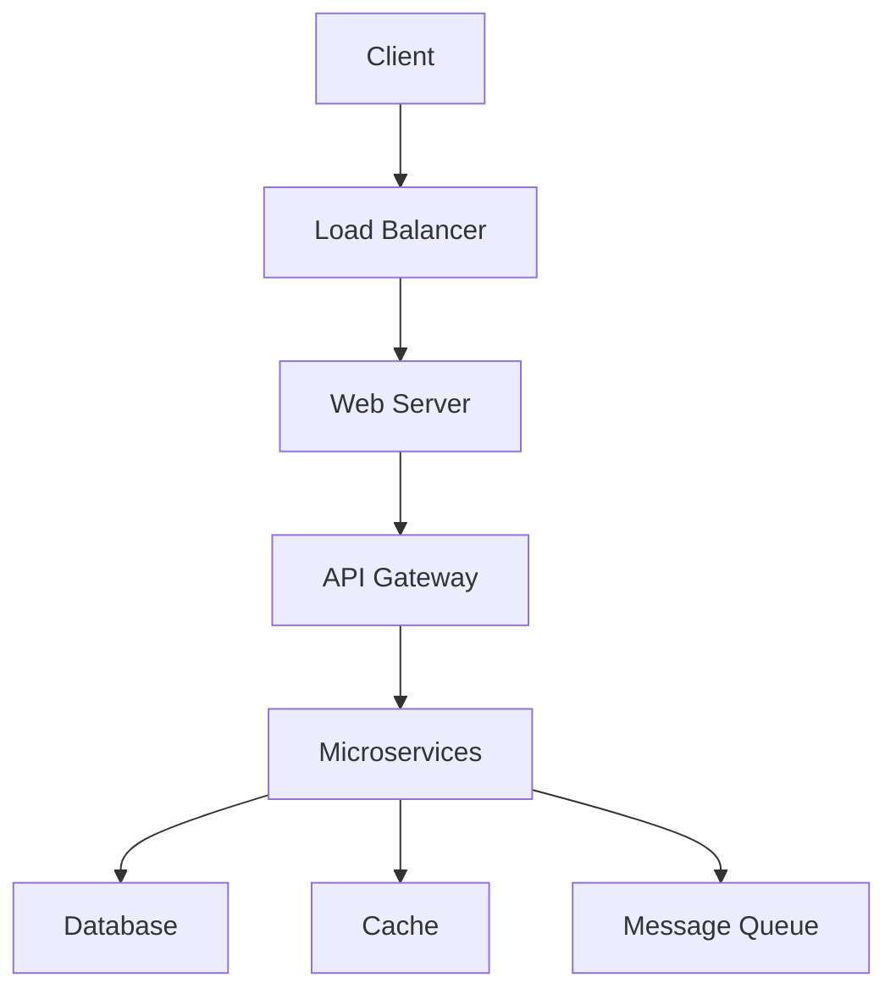

# {{ replace .Name "-" " " | title }}

## 📋 Tổng quan dự án

### Thông tin dự án

- **Loại:** {{ .Params.project_type }}
- **Ngành:** {{ .Params.industry }}
- **Team size:** {{ .Params.team_size }} người
- **Thời gian:** {{ .Params.duration }}

### Công nghệ sử dụng

{{ range .Params.technologies }}
- {{ . }}
{{ end }}

## 🎯 Mục tiêu dự án

### Vấn đề cần giải quyết

### Yêu cầu kỹ thuật

### Kết quả mong đợi

## 🏗️ Kiến trúc hệ thống

### System Architecture



### Technology Stack

**Frontend:**
- React 18
- TypeScript
- Tailwind CSS
- Vite

**Backend:**
- Node.js
- Express.js
- MongoDB
- Redis

**Infrastructure:**
- AWS EC2
- AWS RDS
- AWS S3
- CloudFront CDN

## 🚧 Thách thức và giải pháp

### Thách thức 1: Xử lý traffic cao

**Vấn đề:**
- Website bị crash khi có > 1000 concurrent users
- Response time > 5 giây

**Giải pháp:**
- Implement Redis caching
- Sử dụng CDN cho static assets
- Database connection pooling

**Kết quả:**
- Hỗ trợ được 10,000+ concurrent users
- Response time < 500ms

### Thách thức 2: Tích hợp payment gateway

**Vấn đề:**
- Cần hỗ trợ nhiều phương thức thanh toán
- Bảo mật thông tin thẻ tín dụng

**Giải pháp:**
- Sử dụng Stripe API
- Implement webhook handling
- PCI DSS compliance

**Kết quả:**
- Hỗ trợ 5+ payment methods
- 99.9% transaction success rate

### Thách thức 3: Optimize performance

**Vấn đề:**
- Page load time > 10 giây
- Poor mobile experience

**Giải pháp:**
- Code splitting
- Image optimization
- Lazy loading
- Service Worker caching

**Kết quả:**
- Page load time < 2 giây
- 95+ Lighthouse score

## 📊 Kết quả đạt được

{{ range .Params.results }}
- {{ . }}
{{ end }}

### Metrics trước và sau

| Metric | Trước | Sau | Cải thiện |
|--------|-------|-----|-----------|
| Page Load Time | 10s | 2s | 80% |
| Concurrent Users | 1,000 | 10,000 | 900% |
| Uptime | 95% | 99.9% | 4.9% |
| Conversion Rate | 2% | 5% | 150% |

## 🎓 Bài học kinh nghiệm

### Những gì làm tốt

- [ ] Planning và architecture design
- [ ] Code review process
- [ ] Testing strategy
- [ ] Deployment pipeline

### Những gì cần cải thiện

- [ ] Documentation
- [ ] Monitoring và alerting
- [ ] Security audit
- [ ] Performance testing

### Tips cho dự án tương tự

1. **Luôn có backup plan** cho mọi component
2. **Monitor từ ngày đầu** để phát hiện vấn đề sớm
3. **Test với real data** thay vì dummy data
4. **Document mọi thứ** để team có thể maintain sau này

## 🔧 Code Examples

### Caching Strategy

```javascript
// Redis caching implementation
const redis = require('redis');
const client = redis.createClient();

async function getCachedData(key) {
    try {
        const cached = await client.get(key);
        if (cached) {
            return JSON.parse(cached);
        }
        return null;
    } catch (error) {
        console.error('Cache error:', error);
        return null;
    }
}

async function setCachedData(key, data, ttl = 3600) {
    try {
        await client.setex(key, ttl, JSON.stringify(data));
    } catch (error) {
        console.error('Cache set error:', error);
    }
}
```

### Performance Optimization

```javascript
// Image optimization middleware
const sharp = require('sharp');

app.use('/images/:width/:height/:filename', async (req, res) => {
    const { width, height, filename } = req.params;
    const inputPath = path.join(__dirname, 'uploads', filename);
    
    try {
        const buffer = await sharp(inputPath)
            .resize(parseInt(width), parseInt(height))
            .webp({ quality: 80 })
            .toBuffer();
            
        res.set('Content-Type', 'image/webp');
        res.send(buffer);
    } catch (error) {
        res.status(404).send('Image not found');
    }
});
```

## 🔗 Tài liệu tham khảo

- [Project Documentation](https://docs.example.com)
- [GitHub Repository](https://github.com/example/project)
- [Deployment Guide](https://deploy.example.com)

## 💬 Thảo luận

Bạn có câu hỏi gì về case study này? Hãy để lại bình luận bên dưới!

---

**Dự án:** {{ .Params.project_type }} | **Ngành:** {{ .Params.industry }} | **Team:** {{ .Params.team_size }} người | **Thời gian:** {{ .Params.duration }}
